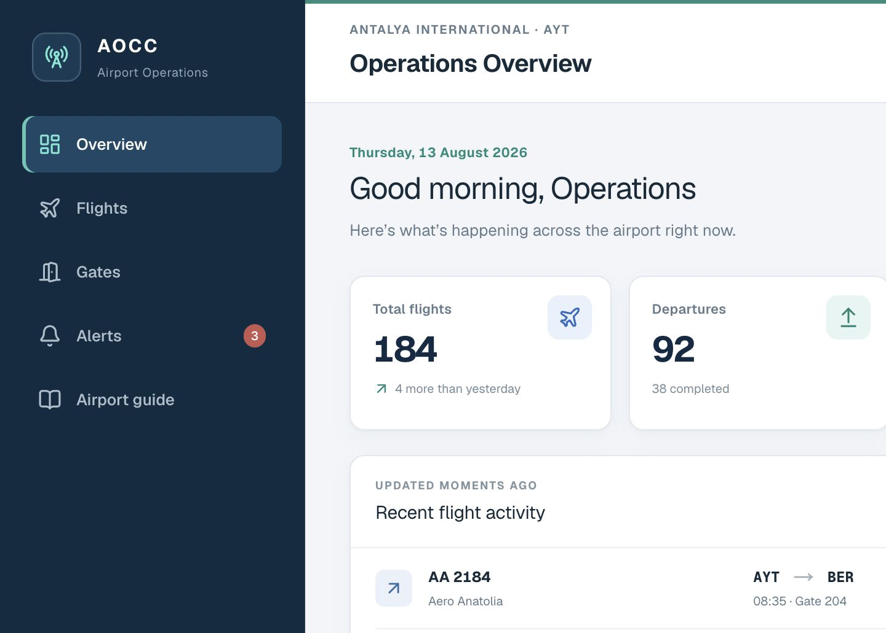
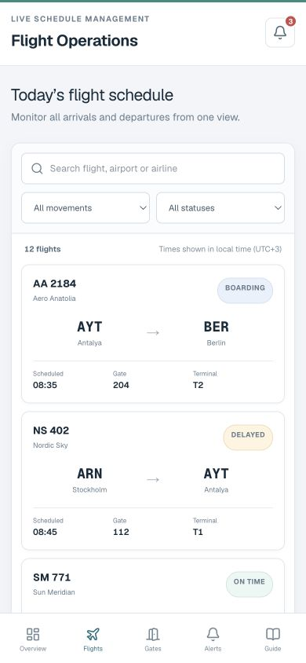
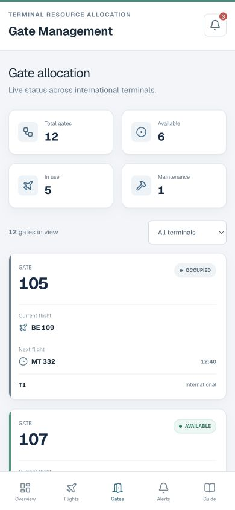

# Airport Operations Control Center

Antalya tarzı yoğun bir uluslararası havalimanının günlük operasyonlarını tek ekranda takip etmek için geliştirdiğim modern bir kontrol merkezi arayüzü.

Bu proje; yalnızca güzel görünen bir dashboard yapmak yerine, gerçek bir frontend ürününde ihtiyaç duyulan **Server Components, SSR, SSG, Route Handlers, TypeScript, responsive tasarım, durum yönetimi ve üretim süreçlerini** birlikte göstermek amacıyla hazırlandı.

> Bu bir portfolyo projesidir. Uçuşlar, havayolları, operasyon uyarıları ve zaman bilgileri kurgusaldır; gerçek bir havalimanı sistemine bağlı değildir.

## Uygulamadan görüntüler

### Operasyon paneli — masaüstü



### Mobil uçuş ve gate ekranları

<p align="center">
  
  
</p>

## Neler yapılabiliyor?

- Günlük toplam uçuş, geliş, gidiş, gecikme ve aktif gate sayılarını takip etme
- Uçuş numarası, havayolu veya havalimanına göre arama yapma
- Uçuşları geliş/gidiş ve operasyon durumuna göre filtreleme
- Mobilde geniş tablo yerine okunabilir uçuş kartları kullanma
- Her uçuş için rota, planlanan/tahmini saat, gate, terminal ve operasyon zaman çizelgesini görüntüleme
- Gate’leri terminale göre filtreleme
- Available, occupied, boarding ve maintenance gate durumlarını ayırt etme
- Operasyon uyarılarını önem derecesine göre görüntüleme ve çözüldü olarak işaretleme
- Statik havalimanı operasyon rehberine erişme

## Sayfalar

| Sayfa | Açıklama |
| --- | --- |
| `/` | Sunucuda render edilen ana operasyon paneli |
| `/flights` | Aranabilir ve filtrelenebilir uçuş listesi |
| `/flights/[id]` | Dinamik uçuş detay sayfası |
| `/gates` | Terminal bazlı gate yönetimi |
| `/alerts` | Operasyon uyarıları |
| `/airport-guide` | Build sırasında statik oluşturulan operasyon rehberi |

## Teknik yapı

- Next.js App Router ve React Server Components
- Strict TypeScript
- Tailwind CSS 4 ve projeye özel responsive tasarım katmanı
- Zustand ile yalnızca gerekli client-side durum yönetimi
- Next.js Route Handlers ile typed REST endpoint’leri
- Yerel mock veriyi izole eden service/repository katmanı
- ESLint, TypeScript kontrolü, production smoke testleri ve GitHub Actions CI
- Docker ile production container desteği

Verinin uygulamadaki akışı şu şekilde:

```text
Page veya Route Handler
        ↓
Typed Service
        ↓
Repository
        ↓
Mock veri kaynağı
```

Sayfalar doğrudan mock veri import etmiyor. İleride gerçek bir REST API veya veritabanı bağlamak için repository/service katmanını değiştirmek yeterli.

## Rendering stratejisi

### SSR

Ana dashboard (`/`) her istekte sunucuda hazırlanıyor. Böylece güncel operasyon verisi ilk HTML ile geliyor ve ana ekranın tamamı client tarafına taşınmıyor.

### SSG

`/airport-guide` sık değişmeyen bir bilgi sayfası olduğu için build sırasında statik olarak oluşturuluyor.

### Dinamik rotalar

`/flights/[id]` App Router dinamik segmentini kullanıyor. Mock veri setindeki uçuşlar için `generateStaticParams()` ile bilinen rotalar build aşamasında hazırlanıyor.

### Client Components ve Zustand

Arama, filtreleme, seçili terminal ve çözülen uyarılar gibi kullanıcı etkileşimleri Client Component olarak çalışıyor. Geri kalan sayfalar Server Component kalmaya devam ediyor.

## REST endpoint’leri

| Method | Endpoint | Dönen veri |
| --- | --- | --- |
| GET | `/api/flights` | Tüm uçuşlar |
| GET | `/api/flights/:id` | Tek uçuş veya typed 404 cevabı |
| GET | `/api/gates` | Gate listesi |
| GET | `/api/alerts` | Operasyon uyarıları |
| GET | `/api/stats` | Dashboard istatistikleri |

Tüm endpoint’ler ortak bir `ApiResponse<T>` yapısı kullanıyor.

## Yerelde çalıştırma

Gereksinimler:

- Node.js 22.13 veya üzeri
- npm 10

```bash
git clone https://github.com/batuhankaratobak/airport-operations-control-center.git
cd airport-operations-control-center
npm ci
cp .env.example .env.local
npm run dev
```

Uygulama varsayılan olarak [http://localhost:3000](http://localhost:3000) adresinde açılır.

## Kalite kontrolleri

Commit göndermeden önce bütün kontrolleri tek komutla çalıştırabilirsiniz:

```bash
npm run check
```

Bu komut sırasıyla şunları çalıştırır:

- ESLint
- TypeScript typecheck
- Production build
- SSR dashboard smoke testi
- Typed API smoke testi

Ayrı ayrı çalıştırmak için:

```bash
npm run lint
npm run typecheck
npm run build
npm test
```

## Docker

```bash
docker build -t airport-operations-control-center .
docker run --rm -p 3000:3000 \
  -e NEXT_PUBLIC_APP_URL=http://localhost:3000 \
  airport-operations-control-center
```

Container root olmayan bir kullanıcıyla çalışır ve `/api/stats` endpoint’i üzerinden health check yapar.

## CI/CD

`.github/workflows/ci.yml` workflow’u her push ve pull request’te:

1. Lockfile ile bağımlılıkları kurar.
2. ESLint çalıştırır.
3. TypeScript kontrolünü yapar.
4. Production build alır.
5. Production çıktısı üzerinden SSR ve API smoke testlerini çalıştırır.

## Deployment

### Vercel

1. Repository’yi Vercel’e import edin.
2. `NEXT_PUBLIC_APP_URL` değişkenini production adresinizle tanımlayın.
3. Repository’deki build ayarlarını koruyarak deploy edin.
4. Deploy sonrasında `/`, `/airport-guide` ve `/api/stats` adreslerini kontrol edin.

Proje ayrıca Vinext/Vite üzerinden Cloudflare Worker uyumlu ESM çıktı üretir.

## Güvenlik notu

- Gerçek `.env` dosyaları Git tarafından takip edilmez.
- Repository’de API anahtarı, parola veya kişisel kullanıcı verisi bulunmaz.
- Mock veriler tamamen kurgusaldır.
- Vinext’in kullandığı `image-size@2.0.2` paketinde ICNS/JXL/HEIF parser’larıyla ilgili yayınlanmış DoS uyarıları bulunuyor. Bu uygulama kullanıcıdan görsel almıyor veya görsel işlemiyor. Uyumlu yamalı sürüm yayınlanana kadar durum açıkça belgelenmiştir.

## Neden bu projeyi yaptım?

Bir frontend geliştiricinin yalnızca component yazmadığını; veri akışını, server/client sınırlarını, responsive davranışı, erişilebilirliği, testleri ve production sürecini de düşünmesi gerektiğini göstermek istedim.

Proje özellikle CV ve portfolyo incelemelerinde kod yapısının rahatça değerlendirilebilmesi için gereksiz backend veya authentication katmanları eklenmeden geliştirildi.
